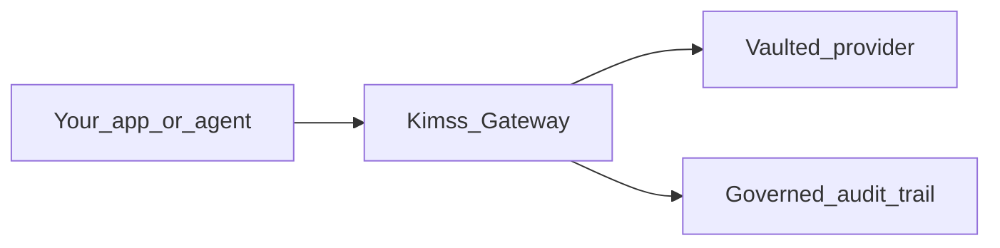

# Kimss — Secure AI Gateway for Autonomous Agents

[](https://pypi.org/project/kimss/)
[](https://pypi.org/project/kimss/)
[](LICENSE)
[](https://github.com/kimssai/kimss-python-sdk/actions/workflows/ci.yml)

**Track, govern, and secure autonomous agents with exactly 1 line of code. Zero data-plane refactoring required.**

[Kimss](https://kimss.ai) is a **Model-Agnostic Enterprise AI Gateway** and **Governance Control Plane** with a **dual-listener** inbound proxy (OpenAI + Anthropic). Keep the native SDK you already use — swap the base URL, add an Agent ID header, and every call gets identity, an audit trail, and a kill switch. Kimss never hosts your models (**BYOI**).

> **AI coding assistants:** read [AI_INTEGRATION.md](AI_INTEGRATION.md) first.

**OpenAI**

```python
from openai import OpenAI

client = OpenAI(
    base_url="https://api.kimss.ai/v1",
    api_key="kimss_workspace_key",
)
response = client.chat.completions.create(
    model="custom:kimss-gpt-5-3",
    messages=[{"role": "user", "content": "Execute audit."}],
    extra_headers={"X-Kimss-Agent-Id": "enterprise_auditor"},
)
```

**Anthropic**

```python
from anthropic import Anthropic

client = Anthropic(
    base_url="https://api.kimss.ai",
    api_key="kimss_workspace_key",
)
response = client.messages.create(
    model="custom:kimss-claude-3-5",
    max_tokens=1024,
    messages=[{"role": "user", "content": "Execute audit."}],
    extra_headers={"X-Kimss-Agent-Id": "enterprise_auditor"},
)
```

Or zero-code:

```bash
OPENAI_BASE_URL="https://api.kimss.ai/v1"
OPENAI_API_KEY="kimss_..."
# or
ANTHROPIC_BASE_URL="https://api.kimss.ai"
ANTHROPIC_API_KEY="kimss_..."
```

**Developer tier (Always Free):** 25,000 governed requests/month · [Get a key](https://kimss.ai/app/signup)

| Inbound (your app → Kimss) | Vaulted BYO (Kimss → your provider) |
|----------------------------|-------------------------------------|
| OpenAI SDK → `https://api.kimss.ai/v1` (`/chat/completions`) | OpenAI, Azure AI Foundry, Anthropic, DeepSeek, custom vLLM |
| Anthropic SDK → `https://api.kimss.ai` (`/v1/messages`) | Internal MCP servers (Control Plane registration) |
| Agent attribution via `X-Kimss-Agent-Id` | |


---

## 3-step setup

### 1. Sign In & Vault

Log into [Kimss AI](https://kimss.ai/app/signup). Open **Governance → Connected Infrastructure** / Provider Vault and vault your model provider endpoint + key.

### 2. Mint Key

On the **Gateway** tab, **Generate Key**. Copy the `kimss_...` Control-Plane workspace key once. Same keys under **Governance → API Keys**.

### 3. Route Traffic (zero refactoring)

Point your **OpenAI** client at `https://api.kimss.ai/v1` or your **Anthropic** client at `https://api.kimss.ai`, set the key, and add `X-Kimss-Agent-Id` (see hero snippets).

Step-by-step: [GETTING_STARTED.md](GETTING_STARTED.md) · 5-minute tutorial: [kimssai/kimss-python-quickstart](https://github.com/kimssai/kimss-python-quickstart) · control-plane OpenAPI: [kimssai/kimss-control-plane](https://github.com/kimssai/kimss-control-plane).

---

## Control plane (DevOps) — optional `pip install kimss`

The **`kimss`** package is an **infrastructure management** client — not an inference SDK. Prefer the OpenAI gateway for all chat/completions.

| Concern | How |
|---------|-----|
| Register external agent | `client.agents.register(...)` → `POST /v1/agents/register` |
| Report BYO usage | `client.usage.report(...)` → `POST /v1/usage/events` |
| Vault endpoint + token cap | REST `POST/PATCH /api/v1/custom-model-endpoints` — [docs](https://kimss.ai/docs/custom_model_endpoints) |
| Kill switch | Governance → Agents, or `POST /agent_set_status/` `{ "id", "status": "disabled" }` (admin) |
| Article 12–style audit | Gateway → Recent calls; `POST /audit_log/`; APIM GatewayLogs when enabled |
| MCP sync | Control Plane / Connected Infrastructure (UI registration) |

```bash
pip install kimss
```

Inference wrappers (`agents.run`, `chat`, `models.create`, …) are **deprecated** — see [CHANGELOG.md](CHANGELOG.md).

---

## Optional: MCP for IDEs

Cursor / Windsurf / Claude Desktop can run `kimss-mcp-server` (`pip install 'kimss[mcp]'` or `uvx --from kimss[mcp] kimss-mcp-server`). MCP inference tools are deprecated; use the OpenAI gateway from application code. Plugin layout: [`.cursor-plugin/plugin.json`](.cursor-plugin/plugin.json).

---

## Examples

See [examples/00_gateway_proxy.py](examples/00_gateway_proxy.py) (OpenAI) and [examples/00b_anthropic_proxy.py](examples/00b_anthropic_proxy.py) (Anthropic).

## License

MIT — see [LICENSE](LICENSE).
